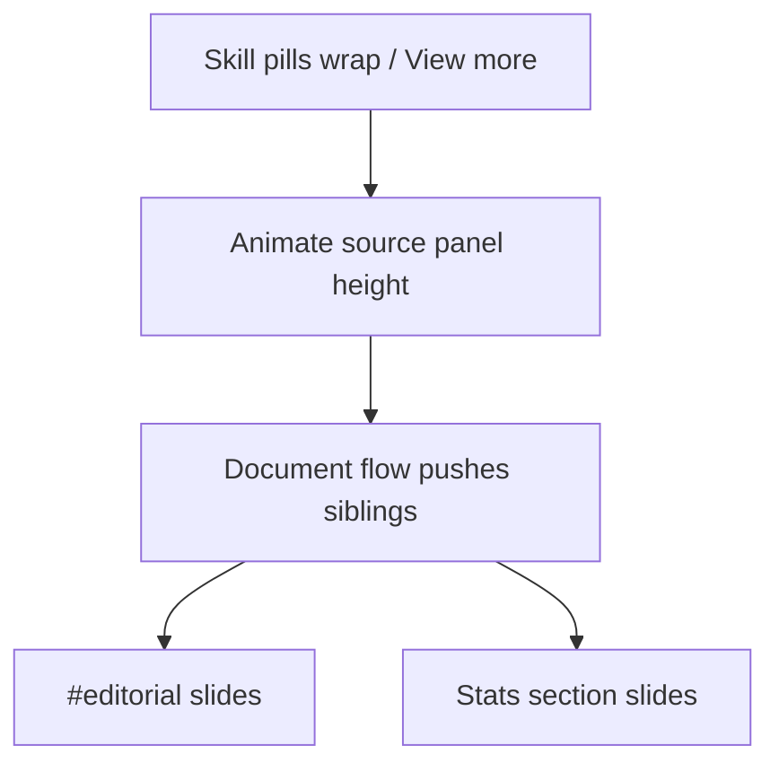

# Plan 47 — Editorial platform tabs + robust drawer reflow

## Problem

1. **Drawer reflow:** Skill pill wrap and the Tools "View more" accordion animate panel height in `motion.js` (`setupPillRowReflow`). Everything below slides via document flow. After inserting `#editorial` between Skills and Stats, the push can read as a jump because `#editorial` had `content-visibility: auto` + a fixed `contain-intrinsic-size` placeholder that does not track live accordion height changes.

2. **Editorial showcase:** Only 3 of 17 articles were `active`. The Services-style row list works for a few items but does not help browse a larger catalog. Platform filter tabs (All / dev.to / Medium) let visitors scan more articles without a long scroll.

## Solution

### Part A — Next-element-agnostic drawer slide

- Remove `content-visibility` from `#editorial` (small, near-fold section; perf cost negligible).
- Clarify `setupPillRowReflow` comment: it animates the *source* panel height; downstream sections (Editorial, Stats, or anything else) slide via normal document flow — no Stats-specific coupling.

### Part B — Editorial platform tabs

- Segmented tablist above the article list: **All**, **dev.to**, **Medium** with counts.
- Tab switch reuses the same drawer height animation as Skills (`--dur-pill-panel-reflow`, `--ease-pill-flip`).
- Activate a curated set of articles (~5 dev.to + ~6 Medium) in `portfolio.json`.

## Files touched

| File | Change |
|------|--------|
| `public/assets/css/styles.css` | Drop `#editorial` content-visibility; add `.editorial-tabs` + `.editorial-panel` |
| `public/assets/js/motion.js` | Update reflow comment |
| `public/assets/js/editorial.js` | `articleFilter`, `platformTabs()`, `filteredArticles()`, `setFilter()` |
| `public/index.html` | Tablist markup + panel wrapper |
| `public/assets/data/portfolio.json` | Activate more articles |

## Verification

- Skills "View more" and pill wrap: Editorial + Stats glide smoothly at 360 / 768 / 1440.
- Tab switch: list height animates drawer-like; `prefers-reduced-motion` skips animation.
- No new network requests; platform icons (`devto`, `medium`) already local.

## Execution status

| Item | Outcome |
|------|---------|
| Drop `#editorial` content-visibility | **Done** |
| Reflow comment in motion.js | **Done** |
| Platform tabs (All / dev.to / Medium) | **Done** |
| Drawer height animation on tab switch | **Done** |
| Activate 11 articles (5 dev.to + 6 Medium) | **Done** |
| Minify JS + CSS | **Done** |

## Follow-up fix (filter active + border radius)

| Issue | Root cause | Fix |
|-------|------------|-----|
| Medium tab active tint broken | `--c-purple` undefined (design system uses `--c-violet`) | Map `data-ci="purple"` to `--c-violet` / `#4a48a8` |
| Active tab hard to read | Inactive `:hover` outshone `.is-active`; tabs were separate glass panels | Segmented track inside one `.editorial-stage` panel; `:not(.is-active):hover`; filled active pill + inverted count badge |
| Border radius broken | Tabs + list were two nested `glass-panel`s; height-anim wrapper had no radius | Single `editorial-stage glass-panel`; `editorial-panel` gets `border-radius`; first/last rows inherit corner radius |
| Filter switch blank rows | Per-row `data-reveal` re-mounted at `opacity:0` on tab change | Removed row-level `data-reveal`; stage reveals once |
